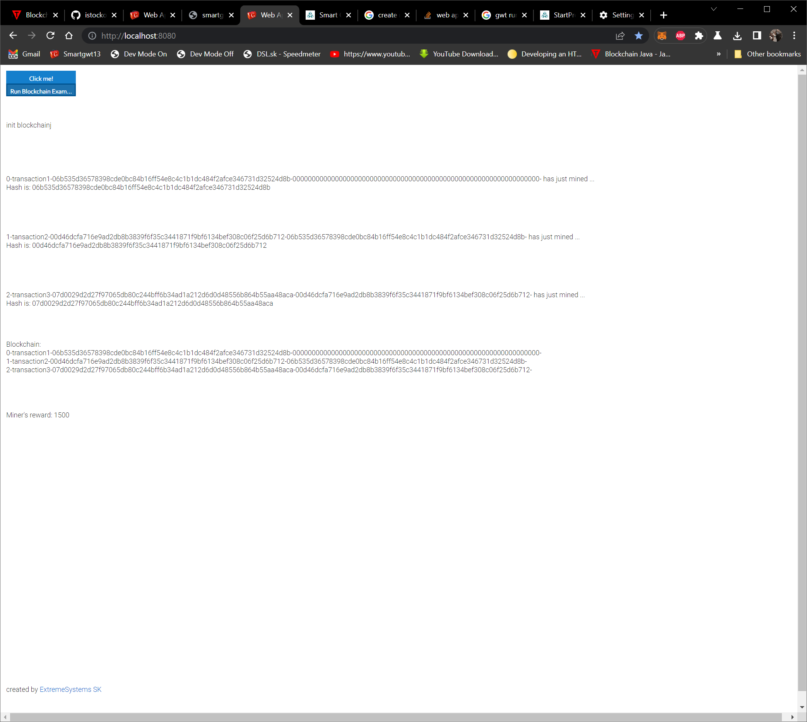

<h1>Development of Web RIA applications with Java using SmartGWT 13.1d</h1>

 

<h2><a href="live/SmartGWT13.html" target="_NEW">Live Example</a></h2>
<iframe src="live/SmartGWT13.html" width="400" height="400"> </iframe>
 
 
<pre>
package sk.extremesystems.smartgwt13.client;

import com.google.gwt.core.client.EntryPoint;
import com.google.gwt.user.client.ui.RootPanel;
import com.smartgwt.client.types.Alignment;
import com.smartgwt.client.util.SC;
import com.smartgwt.client.widgets.Button;
import com.smartgwt.client.widgets.Label;
import com.smartgwt.client.widgets.events.ClickEvent;
import com.smartgwt.client.widgets.events.ClickHandler;
import com.smartgwt.client.widgets.layout.VLayout;

import sk.extremesystems.smartgwt13.client.blockchain.BlockChainExample;

public class SmartGWT13 implements EntryPoint {
	public void onModuleLoad() {
		
		Button b = new Button("Version of SmartGWT ".concat(SC.getScVersion()).concat(" Click here for test"));
		b.setMargin(2);
		b.setWidth("500px");
		b.setBorder("1px red solid");
		b.addClickHandler(new ClickHandler() {
			
			@Override
			public void onClick(ClickEvent event) {
				
				SC.say("SmartGWT v. ".concat(SC.getScVersion()));
				
			}
		});
		
		Label info = new Label("created by <a href='https://www.extremesystems.sk' target='_NEW'>ExtremeSystems SK</a>");
		info.setWidth100();
		
		final VLayout outputInfo = new VLayout();
		Button runBlockchainExample = new Button("Run Blockchain Example");
		runBlockchainExample.addClickHandler(new ClickHandler() {
			
			@Override
			public void onClick(ClickEvent event) {
				BlockChainExample bce = new BlockChainExample();
				bce.bindOutput(outputInfo);
				bce.run();
				
			}
		});
		
		
		VLayout vl = new VLayout();
		vl.setHeight100();
		vl.setWidth100();
		vl.setAlign(Alignment.CENTER);
		vl.addMember(b);
		vl.addMember(runBlockchainExample);
		vl.addMember(outputInfo);
		
		vl.addMember(info);
	
		RootPanel.get("root").add(vl);
	}
		
}

</pre>

<h2>Requirements for setup of IDE eclipse:</h2>
 
 
Open JDK 16
 
Eclipse for EE Developers (2023-09)
 
GWT 2.11.0
 
GWT 4.0.0 Plugin from Eclipse Marketplace 
 
Run with Jetty Plugin from Eclipse Marketplace
 
<a href="https://www.smartclient.com/product/download-bounce.jsp?product=smartgwt&license=lgpl&version=13.1d&nightly=true" download>SmartGWT 13.1d library</a>
 
GIT
 
 
<h2>Deploy test project from github</h2>
 
Clone repository https://github.com/istocko/smartgwt13.git
 
Import project to eclipse
 
Setup project with  GWT (set path where GWT is uzipped)
 
Copy smartgwt libraries (*.jar) to project dir
 
Compile GWT app with Eclipse
 
Run App via Run As -> Run with Jetty
 
Clear Cache in browser (CTRL+Shift+Delete in chrome , check only Chached Images and Files)
 
open http://localhost:8080 in browser
 

 
 
 
<h2>Debugging app</h2>
 
Run As -> Run with Jetty
 
Debug As -> GWT Develepoment Mode
 
open http://localhost:9876 and drag&drop bookmarklets DEV Mode ON and Dev Mode Off to bookmark panel in browser (CTRL+SHIFT+B in chrome)
 
open http://localhost:8080 in browser
 
Click at bookmark Dev Mode On and click at Compile button
 
 
<h2>Presentation of all smartgwt components with source</h2>
Start using smartgwt in your Java web application project 
Showcase about SmartGWT <a href="https://www.smartclient.com/smartgwt/showcase/">here</a>
 
<h2>Example of BlockChain by using <a href="https://github.com/istocko/sk.icoin.blockchainj" target="_NEW">blockchainj</a></h2>
 

