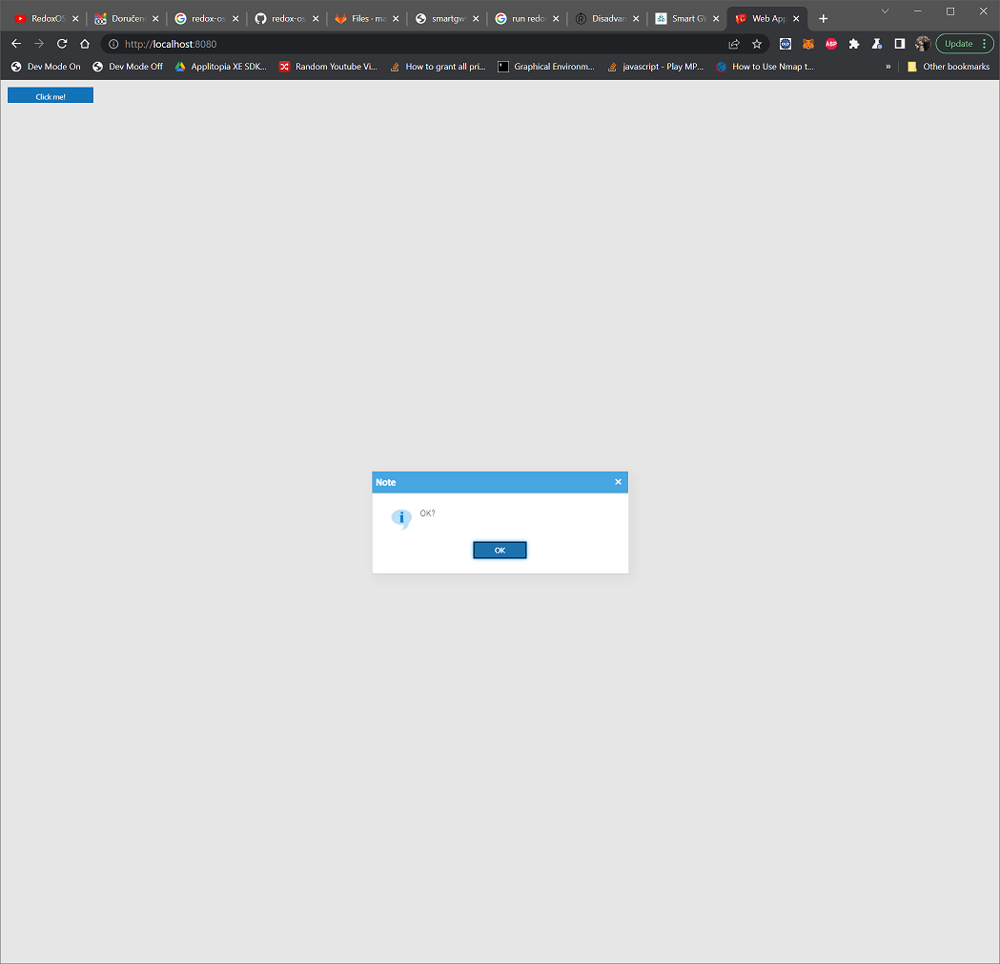

<h1>Development of Web RIA applications with Java using SmartGWT 13</h1>

 

<h2><a href="live/" target="_NEW">Live Example</h2>
<iframe src="live/" width="800" height="600" />
<h2>Requirements for setup of IDE eclipse:</h2>
 
 
Open JDK 13
 
Eclipse for EE Developers
 
GWT 2.9.0
 
GWT Plugin from Eclipse Marketplace (uncheck GWT 2.7.0 and 2.8.0 download option)
 
Run with Jetty Plugin from Eclipse Marketplace
 
<a href="https://www.smartclient.com/product/download-bounce.jsp?product=smartgwt&license=lgpl&version=13.0p&nightly=true" download>SmartGWT 13 library</a>
 
GIT
 
 
<h2>Deploy test project from github</h2>
 
Clone repository https://github.com/istocko/smartgwt13.git
 
Import project to eclipse
 
Setup project with  GWT (set path where GWT is uzipped)
 
Copy smartgwt libraries (*.jar) to project dir
 
Compile GWT app with Eclipse
 
Run As -> configurations -> setup Jetty Web App -> set path target\TestSmartGWT13Jetty-1.0-SNAPSHOT\ 
 
Run App via Run As -> Run with Jetty
 
Clear Cache in browser (CTRL+Shift+Delete in chrome , check only Chached Images and Files)
 
open http://localhost:8080 in browser
 

 
 
 
<h2>Debugging app</h2>
 
Debug As -> GWT Develepoment Mode
 
open http://localhost:9876 and drag&drop bookmarklets DEV Mode ON and Dev Mode Off to bookmark panel in browser (CTRL+SHIFT+B in chrome)
 
open http://localhost:8080 in browser
 
Click at bookmark Dev Mode On and click at Compile button
 
 
<h2>Presentation of all smartgwt components with source</h2>
Start using smartgwt in your Java web application project 
Showcase about SmartGWT <a href="https://www.smartclient.com/smartgwt/showcase/">here</a>
 

